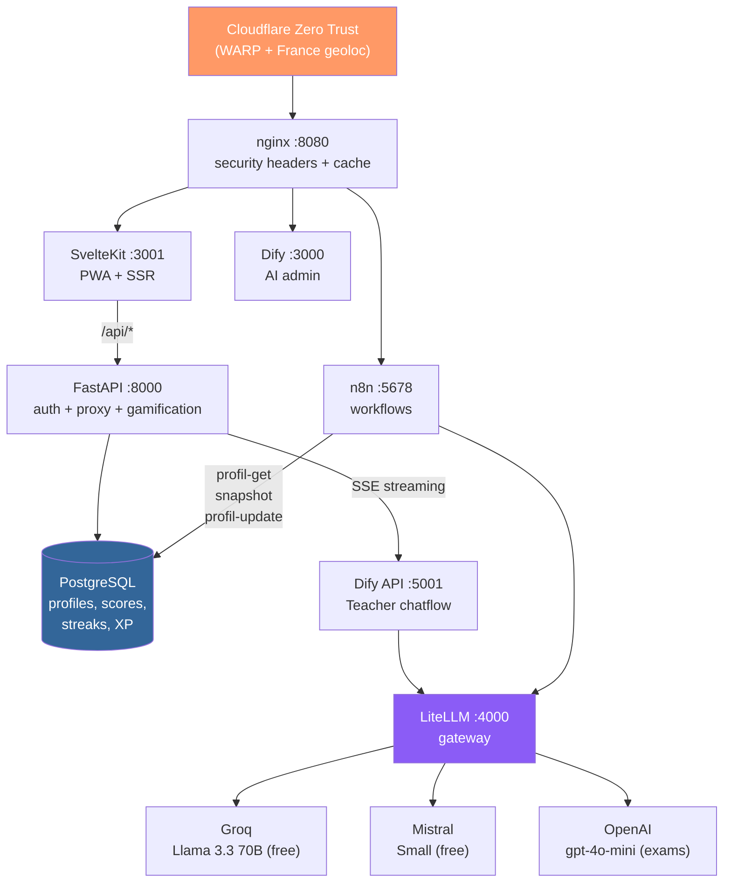
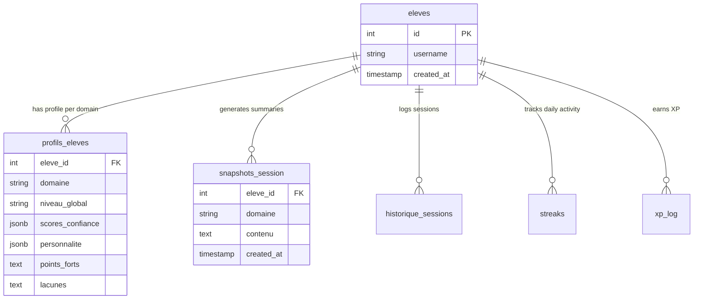

<div align="center">

# AcademIA

**AI-powered language learning platform with adaptive pedagogy**


[English](#what-is-academie-ia) | [Francais](README.fr.md)

</div>

---

## What is AcademIA?

A self-hosted language learning platform that uses multiple AI models to deliver personalized, adaptive lessons. Built for a small group of friends learning English, with an architecture designed to scale to any language or technical domain.

The platform remembers each learner's strengths, weaknesses, and learning style across sessions — no two students get the same experience.

## Key Features

- **Adaptive TTT pedagogy** — Test-Teach-Test cycle with deterministic concept transitions
- **5 LLM models** routed via LiteLLM gateway (Groq, Mistral, OpenAI) — 90% free tier
- **Persistent learner profiles** — confidence scores per concept, streaks, XP, level progression
- **2-level memory system** — session snapshots (short-term) + pedagogical profiles (long-term)
- **Real-time streaming chat** — SSE from Dify chatflows through FastAPI proxy
- **PWA with offline support** — installable, service worker, responsive mobile
- **Quiz/exam mode** — 10-question assessments using premium LLM (gpt-4o-mini)
- **Structured + free mode** — toggle between guided curriculum and open conversation
- **6 active users** with individual profiles and learning histories
- **Multi-domain ready** — English (live), Spanish, Japanese, German, Italian, Python, Cybersec (planned)

## Architecture



## Data Model



## Tech Stack

| Layer | Technology | Role |
|-------|-----------|------|
| Frontend | SvelteKit + TypeScript | PWA, SSR, responsive UI |
| Backend | FastAPI (Python) | Auth, API proxy, gamification logic |
| AI Orchestration | Dify (Chatflow) | Teacher agent — 28 nodes, 45 edges |
| LLM Gateway | LiteLLM | Multi-model routing, fallback, rate limiting |
| Workflows | n8n | Memory webhooks, profile injection |
| Database | PostgreSQL | Profiles, scores, streaks, XP, sessions |
| Cache | Redis | Session cache, Celery broker |
| Reverse Proxy | nginx | Security headers, static caching |
| Security | Cloudflare Zero Trust | WARP + geolocation (France only) |
| Infrastructure | Proxmox + Docker Compose | Self-hosted on NAS |

## Project Structure

```
/opt/academia/
├── webapp/
│   ├── frontend/          # SvelteKit PWA
│   │   ├── src/routes/    # Pages: login, dashboard, chat, stats, changelog
│   │   └── src/lib/       # Components, stores, utilities
│   └── backend/           # FastAPI
│       └── app/           # Routers: auth, chat, profile, settings
├── scripts/               # 26 Python utility scripts
├── curriculums/           # Generated curriculum data
└── .github/assets/        # Screenshots and visual assets
```

## Key Design Decisions

| Decision | Alternatives Rejected | Rationale |
|----------|-----------------------|-----------|
| LiteLLM as LLM gateway | Direct API calls | Load balancing, automatic fallback, free tier rotation |
| Dify Chatflow for Teacher | Custom Python LLM backend | Visual flow editor, rapid iteration on 28-node chatflow |
| SvelteKit custom webapp | Dify native UI | Full UX control, gamification, branding, PWA |
| Groq free tier as primary | OpenAI only (paid) | 0 EUR for 90% of sessions, sufficient quality for B1-C1 |
| n8n for orchestration | Custom Python cron scripts | Visual workflows, webhooks, easier maintenance |
| Self-hosted Proxmox | Cloud (AWS/GCP/Vercel) | 0 EUR/month, full control, infrastructure learning |
| Cloudflare Zero Trust | Traditional VPN | Zero-config clients, free WARP, geoloc filtering |
| 4-level backup strategy | Git only | Defense in depth: Proxmox + PG dump + Restic/GDrive + Git |

## Lessons Learned

**What worked well:**
- Dify Chatflows are excellent for rapid prompt iteration — the visual editor saved hours compared to managing prompt templates in code
- LiteLLM's fallback routing means zero downtime when Groq hits rate limits — users never notice
- The TTT (Test-Teach-Test) approach with deterministic concept transitions keeps sessions focused without feeling rigid

**What surprised us:**
- Groq's free tier is genuinely usable for production — Llama 3.3 70B handles B1-C1 English teaching remarkably well
- The 2-level memory system (session snapshots + long-term profiles) creates a convincing "the AI remembers me" experience with minimal infrastructure
- Cloudflare Zero Trust with WARP is simpler than any VPN setup we've tried

**What we'd do differently:**
- Start with PostgreSQL from day one instead of exploring SQLite/JSON files
- Skip the Qdrant/Ollama detour — turned out RAG wasn't needed for curriculum delivery
- Build the custom webapp earlier — Dify's native UI was limiting from the start

**Current limitations:**
- Single-server architecture (no horizontal scaling, but sufficient for 6 users)
- No automated tests beyond smoke-tests (functional tests planned)
- Teacher is the only fully-developed agent — other domains are planned but not built

## Getting Started

### Prerequisites

- Docker + Docker Compose
- A Proxmox host (or any Debian server)
- Groq API key (free at console.groq.com)
- Cloudflare account (free tier sufficient)

### Quick Start

```bash
# Clone and configure
git clone https://github.com/Sinsemilila/academie-ia.git /opt/academia
cd /opt/academia

# Set up environment
cp .env.example .env  # Edit with your API keys

# Start all services
docker compose up -d

# Verify
smoke-test --all
```

> **Note**: This project is self-hosted and configured for a specific infrastructure. The getting started guide is simplified — full deployment requires Dify, n8n, LiteLLM, and Cloudflare configuration.

## Project History

This project was built over 8 intensive days by a solo developer working with AI coding agents. The Teacher chatflow alone went through 17 major versions. For the full engineering journey — from bare metal Proxmox to production multi-AI platform — see **[HISTORY.md](HISTORY.md)**.

## License

MIT License. See [LICENSE](LICENSE) for details.

---

<div align="center">

Built with curiosity by [Sinse](https://github.com/Sinsemilila) and an army of AI agents.

</div>
