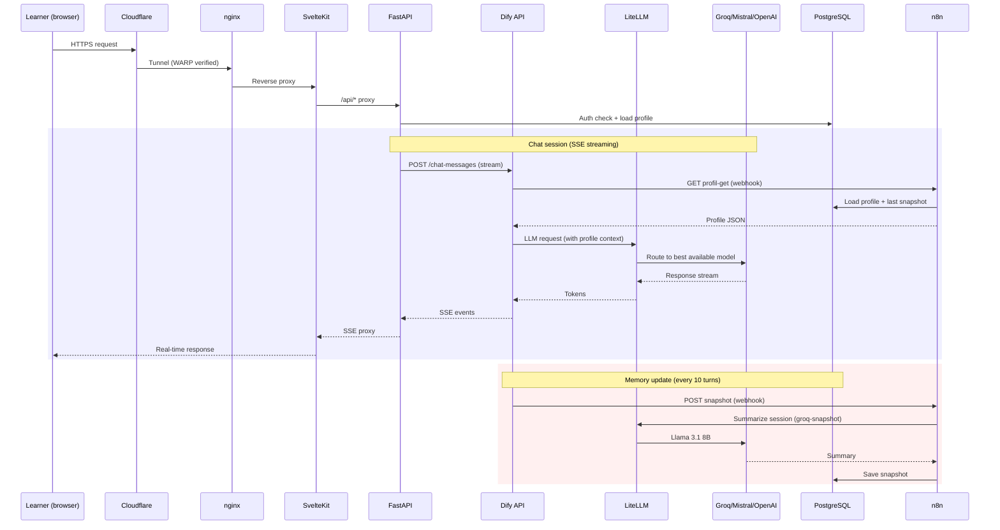
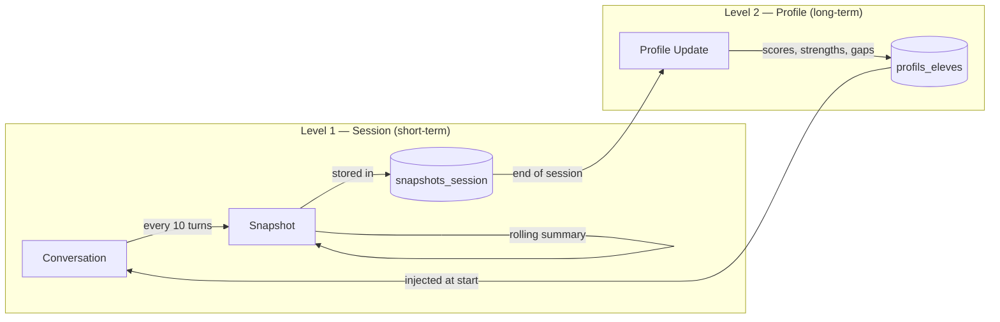

# Architecture — AcademIA

## Request flow (learner perspective)



## Memory system



## Infrastructure

```
NAS (Synology)
└── Proxmox VE
    └── VM cosmos (Debian, 12GB RAM)
        ├── Docker Compose
        │   ├── academie-frontend (SvelteKit :3001)
        │   ├── academie-api (FastAPI :8000)
        │   ├── dify-web + dify-api + dify-worker + dify-sandbox
        │   ├── litellm-proxy (:4000)
        │   ├── postgres-academie (:5432)
        │   ├── redis-academie
        │   ├── n8n-academie (:5678)
        │   └── cosmos-server (reverse proxy)
        ├── nginx (:8080 → Cloudflare Tunnel)
        └── 2 SSDs: boot (50G) + data (850G)
```
