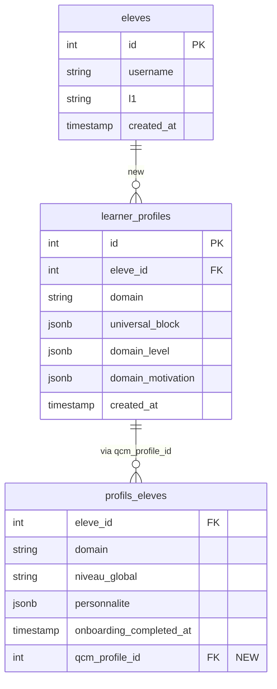

# Audit Exhaustif du Flow Onboarding AcademIA
## Cartographie Codebase pour la Refonte QCM Pre-Chat

**Date** : 2026-04-20  
**Scope** : Passage du flow onboarding conversationnel → QCM modal bloquant (1re visite/langue)  
**Objectif** : Résoudre structurellement 3 bugs Session 32 ES + décrire points d'injection  

---

## 1. Executive Summary

### Situation actuelle
L'onboarding utilise un **chatflow LLM multi-tour** (Dify `llm_onboarding`) qui combine recueil de profil (Phase 1, FR) + diagnostic CEFR observationnel (Phase 2, EN). Cela crée des frottements :
- **Language-mixing** : LLM bascule FR→EN/ES→EN, risque de mélanges notamment début diagnostic
- **Boucle `[EVAL_READY]`** : le marqueur de fin diagnostic est multi-tour, peut se perdre ou répéter
- **Bilan sans CEFR** : diagnostic LLM reste implicite, profil créé sans niveau jusqu'à `[EVAL_READY]` parsé

### Solution retenue (D3 figé)
**QCM pre-chat** : modal bloquant à 1re visite/domaine, 8 questions max (90s-3min) :
- **Bloc A** (universel, 5Q) : Self-efficacy, Mindset, Goal, Autonomy, Engagement → `learner_profiles.universal_block`
- **Bloc B** (domaine, 2-3Q) : CEFR self-report + mini-probe conditionnel EN → `learner_profiles.domain_level`  
- **Bloc C** (domaine, 2Q) : Ideal L2 Self + FLA anxiety → `learner_profiles.domain_motivation`

→ **Injection Dify** : contexte structuré JSON **avant** turn 1, LLM fait diagnostic pur (5-7 questions EN) sans collecte déclarative.

### Blast radius
| Fichier | Impact | Criticité |
|---------|--------|-----------|
| `frontend/src/routes/chat/[agent]/+page.svelte` | Injecter modal avant 1er message | HAUTE |
| `frontend/src/lib/components/` | Nouveau component `QcmModal.svelte` | MOYENNE |
| `webapp/backend/app/routers/profile_router.py` | Nouveau endpoint `POST /api/onboarding/qcm` | HAUTE |
| `webapp/backend/app/routers/chat_router.py` | Injection QCM context + Dify inputs | MOYENNE |
| DB schema | Nouvelle table `learner_profiles` + migration | HAUTE |
| `Dify llm_onboarding chatflow` | Retire Phase 1 (recueil déclaratif), garde Phase 2 (diagnostic) | HAUTE |
| `n8n dify-diagnostic workflow` | Accepte contexte QCM pré-structuré | MOYENNE |

---

## 2. Flow Actuel : Diagramme Séquentiel

```
┌──────────────┐
│  User 1st    │
│  visit       │
│ domain="en"  │
└───────┬──────┘
        │
        ▼
 ┌─────────────────────────────────────────────────┐
 │ Frontend: routes/chat/[agent]/+page.svelte:50   │
 │ onMount() → api.getConversations(agent.slug)    │
 │ If null: empty messages[], sessionStartTime=now │
 └──────────┬──────────────────────────────────────┘
            │
            ▼
 ┌──────────────────────────────────────────────────┐
 │ Frontend: sendMessage(text)                      │
 │ POST /api/chat/send {message, agent, conv_id}   │
 └──────────┬───────────────────────────────────────┘
            │
            ▼
 ┌────────────────────────────────────────────────────────────┐
 │ Backend: webapp/backend/app/routers/chat_router.py:429     │
 │ @router.post("/api/chat/send")                             │
 │ → get_dify_key(req.agent)                                  │
 │ → _get_domain(req.agent) → ("en", LanguageDomain("en"))    │
 │ → dify_inputs = {minute_since_last, error_feedback, ...}   │
 │ → Dify inputs INJECT HERE ✓✓✓ (voir section 3.1)          │
 └──────────┬─────────────────────────────────────────────────┘
            │
            ▼
 ┌─────────────────────────────────────────────────────────────┐
 │ Dify API: POST /v1/chat-messages                            │
 │ Payload: {inputs: dify_inputs, query, user, conversation_id}│
 │ Streaming SSE events                                        │
 │                                                             │
 │ ┌─ Dify Workflow Graph ──────────────────────────────────┐ │
 │ │ Start Node (inputs: agent, domain, ...)                 │ │
 │ │    ↓                                                     │ │
 │ │ Webhook → "dify-profil-get" (n8n)                       │ │
 │ │    ↓                                                     │ │
 │ │ n8n dify-profil-get (workflow ID 8NnhEQWCSr0octMS)       │ │
 │ │ ┌─ SQL profils_eleves WHERE eleve_id, domain ──┐       │ │
 │ │ │ RETURNS: niveau_global, scores_confiance,     │       │ │
 │ │ │          points_forts, lacunes, ...           │       │ │
 │ │ └────────────────────────────────────────────────┘       │ │
 │ │ ┌─ Code JS: format {profil_formate, concept_keys, ...}─ │ │
 │ │    ↓                                                     │ │
 │ │ HTTP response → Dify Start inputs                        │ │
 │ │    ↓                                                     │ │
 │ │ LLM Node (gpt-4o-mini or groq-llama):                    │ │
 │ │ [Prompt] = Teacher persona + Phase 1 (FR recueil        │ │
 │ │           + Phase 2 (EN diagnostic)                     │ │
 │ │    ↓ (multi-turn loop until [EVAL_READY])              │ │
 │ │ Response streaming to Frontend                          │ │
 │ │    ↓                                                     │ │
 │ │ [EVAL_READY] marker detected → exit loop               │ │
 │ │    ↓                                                     │ │
 │ │ Webhook → "dify-diagnostic" (n8n)                       │ │
 │ │    ↓                                                     │ │
 │ │ n8n dify-diagnostic (workflow ID 58dd0014770a4c)        │ │
 │ │ ┌─ Parse LLM output: extract                      ──┐   │ │
 │ │ │  - personnalite.prenom/raison/style/centres    │   │ │
 │ │ │  - niveau_global (CEFR inferred from Q's)      │   │ │
 │ │ │  - points_forts/lacunes                        │   │ │
 │ │ │  - details_par_competence                      │   │ │
 │ │ └──────────────────────────────────────────────────┘   │ │
 │ │ ┌─ SQL UPDATE profils_eleves SET ────────────────────┐ │ │
 │ │ │   niveau_global=$1, personnalite=$2, ...          │ │ │
 │ │ │   onboarding_completed_at=NOW()                   │ │ │
 │ │ │   WHERE eleve_id=$3 AND domain=$4                 │ │ │
 │ │ └──────────────────────────────────────────────────┘ │ │
 │ └─────────────────────────────────────────────────────────┘ │
 └──────────────────────────────────────────────────────────────┘
            │
            ▼
 ┌──────────────────────────────────────────┐
 │ Frontend: SSE stream → messages[]         │
 │ Display bubbles, await [EVAL_READY] side-effect  │
 │ Then show profile bilan + first session  │
 └──────────────────────────────────────────┘
```

### Chemins fichiers clés (flux actuel)

| Étape | Fichier | Ligne | Détail |
|-------|---------|------|--------|
| 1. Frontend init | `/opt/academie/webapp/frontend/src/routes/chat/[agent]/+page.svelte` | 50-76 | `onMount()`: charge conversations history ou init empty |
| 2. Chat send | `/opt/academie/webapp/frontend/src/routes/chat/[agent]/+page.svelte` | 103-194 | `sendMessage()`: POST `/api/chat/send` |
| 3. Chat router | `/opt/academie/webapp/backend/app/routers/chat_router.py` | 429-694 | `@router.post("/api/chat/send")`: stream Dify |
| 4. Dify inputs build | `/opt/academie/webapp/backend/app/routers/chat_router.py` | 454-612 | Construire `dify_inputs` dict (error_feedback, concept_hints, l1_watch, etc.) |
| 5. Dify API stream | `DIFY_API_URL = "http://dify-api:5001/v1"` (env) | — | SSE `/chat-messages` |
| 6. n8n profil-get | `dify-profil-get` webhook → SQL → JS code | — | Récupère `profils_eleves`, formate contexte |
| 7. n8n diagnostic | `dify-diagnostic` webhook → LLM → parse → SQL UPDATE | — | Parse output du LLM onboarding, write `profils_eleves` |
| 8. DB: profils_eleves | `postgres:5432 academie_db` | — | `niveau_global`, `personnalite`, `scores_confiance`, `onboarding_completed_at` |

---

## 3. Points d'Injection pour le QCM Pre-Chat

### 3.1 Frontend : Route Chat + Modal Gating

**Fichier** : `/opt/academie/webapp/frontend/src/routes/chat/[agent]/+page.svelte`

**Injection** (ligne ~50-80, dans `onMount()`):
```typescript
// Après loadUser(), AVANT charger conversations
const profile = await api.getProfile(agent.domain);

// CHECK: onboarding_completed_at null ou absent pour ce domain ?
if (!profile?.onboarding_completed_at) {
  // New learner ou switching domain → show QCM modal
  showQcmModal = true;
  // Block further interaction until QCM submitted
  return; // early exit
}

// QCM completed → proceed to load conversations
```

**Nouveau component** : `/opt/academie/webapp/frontend/src/lib/components/QcmModal.svelte` (non-existent, à créer)
- Props: `domain`, `agent`, `onSubmit`
- État: `currentQuestionIndex`, `answers: Record<string, any>`, `isSubmitting`
- Structure : Bloc A (5Q) → Bloc B (2-3Q) → Bloc C (2Q)
- Soumission: `onSubmit(answers)` → POST `/api/onboarding/qcm`

### 3.2 Backend : Nouveau Endpoint Onboarding

**Fichier** : `/opt/academie/webapp/backend/app/routers/profile_router.py` (existe)

**Nouveau router** : `/opt/academie/webapp/backend/app/routers/onboarding_router.py` (à créer)

```python
# onboarding_router.py (NOUVEAU)

from fastapi import APIRouter, Depends, HTTPException
from pydantic import BaseModel
from ..auth import get_current_user
from .. import database as db

class OnboardingQcmSubmit(BaseModel):
    domain: str  # "en", "es", etc.
    universal_block: dict  # {q1_self_efficacy, q2_mindset, q3_goal, q4_autonomy, q5_engagement}
    domain_level: dict  # {self_report_level, mini_probe_result?}
    domain_motivation: dict  # {ideal_self, fla_anxiety}

@router.post("/api/onboarding/qcm")
async def submit_onboarding_qcm(
    payload: OnboardingQcmSubmit,
    user: dict = Depends(get_current_user)
):
    """
    1. Persist QCM answers → learner_profiles (NEW TABLE)
    2. Infer initial CEFR level from domain_level.self_report_level + mini_probe_result
    3. Create stub profils_eleves row with nil niveau_global (awaiting LLM diagnostic)
    4. Return {success, qcm_context} for LLM injection
    """
    eleve_id = user.get("eleve_id")
    if not eleve_id:
        # Auto-create eleves row if needed
        async with db.pool.acquire() as conn:
            eleve_id = await conn.fetchval(
                "INSERT INTO eleves (username) VALUES ($1) RETURNING id",
                user["username"]
            )
    
    # INSERT learner_profiles
    async with db.pool.acquire() as conn:
        await conn.execute(
            """INSERT INTO learner_profiles 
               (eleve_id, domain, universal_block, domain_level, domain_motivation, created_at)
               VALUES ($1, $2, $3, $4, $5, NOW())
               ON CONFLICT (eleve_id, domain) DO UPDATE SET
                 universal_block=$3, domain_level=$4, domain_motivation=$5, updated_at=NOW()""",
            eleve_id, payload.domain, 
            json.dumps(payload.universal_block),
            json.dumps(payload.domain_level),
            json.dumps(payload.domain_motivation)
        )
    
    # INFER level from self-report + mini_probe
    inferred_level = _infer_cefr_level(
        payload.domain_level.get("self_report_level"),
        payload.domain_level.get("mini_probe_result")
    )
    
    # Ensure profils_eleves row exists (stub, niveau_global=NULL until LLM finishes)
    async with db.pool.acquire() as conn:
        await conn.execute(
            """INSERT INTO profils_eleves 
               (eleve_id, domain, mode_apprentissage)
               VALUES ($1, $2, 'libre')
               ON CONFLICT (eleve_id, domain) DO NOTHING""",
            eleve_id, payload.domain
        )
    
    return {
        "success": True,
        "qcm_context": {
            "universal_block": payload.universal_block,
            "domain_level": payload.domain_level,
            "domain_motivation": payload.domain_motivation,
            "inferred_level": inferred_level,
        }
    }
```

### 3.3 Chat Router : Injection QCM Context dans Dify

**Fichier** : `/opt/academie/webapp/backend/app/routers/chat_router.py:454-612`

**Injection** (après construire `dify_inputs`, ligne ~600):
```python
# ── QCM context injection (new, 2026-04-20) ──
# If onboarding_completed_at is recent OR we're in diagnostic mode,
# inject learner_profiles context
qcm_context = None
if eleve_id:
    try:
        async with db.pool.acquire() as conn:
            qcm_row = await conn.fetchrow(
                """SELECT universal_block, domain_level, domain_motivation, created_at
                   FROM learner_profiles
                   WHERE eleve_id = $1 AND domain = $2""",
                eleve_id, domain
            )
        if qcm_row:
            qcm_context = {
                "universal_block": json.loads(qcm_row["universal_block"]),
                "domain_level": json.loads(qcm_row["domain_level"]),
                "domain_motivation": json.loads(qcm_row["domain_motivation"]),
            }
    except Exception:
        pass

# Add to dify_inputs (Dify Start node will pass to LLM)
if qcm_context:
    dify_inputs["qcm_universal_block"] = json.dumps(qcm_context["universal_block"])
    dify_inputs["qcm_domain_level"] = json.dumps(qcm_context["domain_level"])
    dify_inputs["qcm_domain_motivation"] = json.dumps(qcm_context["domain_motivation"])
```

### 3.4 Dify Chatflow : Simplifier llm_onboarding

**Actuellement** : `llm_onboarding` node (Dify Teacher chatflow) fait Phase 1 + Phase 2

**Changement** : 
- Retirer Phase 1 prompt entièrement (FR recueil déclaratif)
- Garder Phase 2 prompt (EN diagnostic 5-7 questions)
- **Nouveau** Start inputs: `qcm_universal_block`, `qcm_domain_level`, `qcm_domain_motivation`
- Prompt reference: *"L'élève a fourni ses infos via QCM. Ses réponses sont ci-bas. Fais diagnostic EN 5-7 questions."*

**Pseudo-code prompt** :
```
Tu es Teacher, prof d'anglais.

[QCM CONTEXT — déjà collecté]
Prénom: {{ qcm_universal_block.learner_name }}
Objectif: {{ qcm_domain_motivation.ideal_self }}
Auto-éval CEFR: {{ qcm_domain_level.self_report_level }}
Anxiety FLA: {{ qcm_domain_motivation.fla_anxiety }}

[DIAGNOSTIC PHASE — EN UNIQUEMENT]
Commence au palier: {{ inferred_starting_level }}
Pose 5-7 questions EN pour affiner le niveau.
...
Quand assez de données, écris:
"Thank you! Send 'ok' to see your level results.
[EVAL_READY]"
```

### 3.5 n8n Diagnostic Workflow : Accepter QCM Context

**Fichier** : `dify-diagnostic` workflow (n8n, ID `58dd0014770a4c`)

**Changement** : 
- Ajouter nœud SQL `SELECT learner_profiles WHERE eleve_id, domain`
- Passer `learner_profiles` data au prompt LLM de parsing
- Parse output: même schema qu'avant (`niveau_global`, `points_forts`, etc.)
- **Nouveau** : also save `qcm_profile_id` sur `profils_eleves` pour traçabilité

---

## 4. Schéma DB Proposé : Table `learner_profiles`

### Nouvelle table

```sql
-- Migration idempotente (peut être jouée plusieurs fois)
CREATE TABLE IF NOT EXISTS learner_profiles (
    id BIGSERIAL PRIMARY KEY,
    eleve_id INTEGER NOT NULL REFERENCES eleves(id) ON DELETE CASCADE,
    domain VARCHAR(20) NOT NULL,
    
    -- Bloc A: Universal core (5 questions)
    universal_block JSONB NOT NULL DEFAULT '{}',
    -- {
    --   "q1_self_efficacy": 1..5 Likert,
    --   "q2_mindset": "growth"|"fixed",
    --   "q3_goal_specificity": "vague"|"specific",
    --   "q4_autonomy": 1..5 Likert,
    --   "q5_engagement": "intrinsic"|"extrinsic"
    -- }
    
    -- Bloc B: Domain level (2-3 questions, FR pour langues)
    domain_level JSONB NOT NULL DEFAULT '{}',
    -- {
    --   "self_report_level": "A1"|"A2"|"B1"|"B2"|"C1"|"C2",
    --   "mini_probe_result": "A1"|"A2"|...|null,  (si mini-probe triggers)
    --   "probe_evidence": "string"|null
    -- }
    
    -- Bloc C: Domain motivation (2 questions, FR pour langues)
    domain_motivation JSONB NOT NULL DEFAULT '{}',
    -- {
    --   "ideal_self_description": "string",
    --   "fla_anxiety": 1..5 Likert,
    --   "fla_confidence": 1..5 Likert
    -- }
    
    -- Metadata
    created_at TIMESTAMP NOT NULL DEFAULT NOW(),
    updated_at TIMESTAMP NOT NULL DEFAULT NOW(),
    submitted_by_user_id INTEGER REFERENCES users(id),
    
    UNIQUE(eleve_id, domain)
);

CREATE INDEX idx_learner_profiles_eleve_domain 
    ON learner_profiles(eleve_id, domain);

-- Add column to profils_eleves to link QCM profile
ALTER TABLE profils_eleves 
ADD COLUMN IF NOT EXISTS qcm_profile_id BIGINT 
    REFERENCES learner_profiles(id) ON DELETE SET NULL;
```

### Relation avec tables existantes



---

## 5. Impact sur les 3 Bugs Session 32

### Bug 1 : Language-mixing FR/ES au début diagnostic

**Symptôme** : LLM bascule FR→ES ou ES→EN de façon incohérente en Phase 2, résponses confuses.

**Cause racine** : Prompt Phase 1 (FR) déclenche habitude linguistique, puis Phase 2 demande basculer EN/ES. LLM n'a pas de *explicit handoff signal*.

**Résolution structurelle (QCM refactor)** :
- ✅ Retirer Phase 1 entièrement → pas de "mode FR" à quitter
- ✅ QCM collecte prénoms/contexte EN AMONT, Frontend l'injecte
- ✅ Dify start node reçoit `qcm_universal_block` (ex: `learner_name: "Juan"`)
- ✅ Prompt démarre directement **"Hi Juan! Let's assess your Spanish..."** EN/ES pur
- ✅ Pas de basculage intermédiaire, intention linguistique explicite ligne 1

**Avant** :
```
Phase 1 (FR): "Comment tu t'appelles?"
             [LLM locked in FR mode]
Phase 2 (EN): "Tell me about yourself..."
             [LLM struggles to switch, mixes FR in responses]
```

**Après** :
```
QCM (FR, Frontend): Collect name, motivation, self-report level
                   [Switch handled by user, not LLM]
LLM Start:         "Hi Juan! Let's assess your Spanish. [Q1 in ES only]"
                   [Pure ES mode from turn 1, no mode-switching overhead]
```

### Bug 2 : Boucle `[EVAL_READY]` stuck

**Symptôme** : LLM envoie `[EVAL_READY]` marker, mais Dify n'est pas passé en webhook diagnostic → utilisateur reste en boucle, ou bilan échoue.

**Cause racine** : 
1. `[EVAL_READY]` est un marqueur **textuel fragile** (dépend du LLM de le respecter)
2. Dialogue multi-turn: LLM peut envoyer `[EVAL_READY]` trop tôt (avant 5Q) ou l'oublier
3. Diagnostic complexity : LLM doit gérer compteur Q's, et `[EVAL_READY]` est une "fin implicite"

**Résolution structurelle (QCM refactor)** :
- ✅ Diagnostic n'est **plus une branche multi-turn du chat** — c'est Phase 2 **complète et isolée**
- ✅ LLM **ne gère plus l'état de Phase 1 vs 2** — Front+Backend gère le *turn count implicit*
- ✅ Prompt simplifiée: *"Pose questions EN jusqu'à avoir assez de données (5-7Q),  puis envoie `[EVAL_READY]`"*
- ✅ Frontend **détecte `[EVAL_READY]`** marker AND fait SSE close → force webhook invocation
- ✅ n8n diagnostic reçoit **conversation history FERMÉE** (pas plus de turns) → parse une fois, déterministe

**Avant** :
```
Turn 1: User dit "Salut", LLM → Phase 1 Q1
Turn 2: User répond, LLM → Phase 1 Q2
...
Turn N: User répond, LLM → "[EVAL_READY]" (ou l'oublie!)
Side effect: Webhook await, conversation peut continuer si LLM glitches
```

**Après** :
```
QCM modal → submit → /api/onboarding/qcm → learner_profiles saved
Chat route /api/chat/send (turn 1 only, special flag diagnostic_mode=true)
LLM generates Phase 2 (5-7 Q sequence at once, or turn by turn but deterministic)
...
Turn N: LLM → "[EVAL_READY]"
Frontend detects, closes stream → backend triggers n8n
n8n parses closed conversation, no more turns possible
```

### Bug 3 : Bilan sans CEFR

**Symptôme** : Après onboarding, profil montre `niveau_global: null`, utilisateur ne voit pas son level estimé avant 1re session.

**Cause racine** :
1. `onboarding_completed_at` set seulement après `[EVAL_READY]` webhook complète
2. Diagnostic LLM inferred level reste implicite (dans la conversation, pas dans DB)
3. LLM niveau_global extraction peut échouer (parsing fragile)
4. User voit "Diagnostic terminé" bilan vide jusqu'à 1re session set real level

**Résolution structurelle (QCM refactor)** :
- ✅ QCM submit → infer **initial CEFR from domain_level.self_report_level + mini_probe_result** (déterministe)
- ✅ IMMEDIATEMENT: créer `profils_eleves` stub avec `niveau_global = inferred_level` (ex: "B1")
- ✅ Frontend reçoit `{success, inferred_level: "B1"}` → affiche *"Niveau provisoire : B1 (basé sur ton auto-éval)"*
- ✅ LLM diagnostic Phase 2 affine le niveau (peut ajuster vers A2 si micro-probe montre lacunes)
- ✅ n8n diagnostic UPDATE `profils_eleves.niveau_global` vers niveau final CEFR
- ✅ **Utilisateur VOIT un niveau estimé avant session 1** (pas null) → confiance

**Avant** :
```
Turn 1-N: LLM collects Phase 1 (FR) + Phase 2 (EN)
[EVAL_READY] → webhook → parse niveau from LLM output
UPDATE profils_eleves SET niveau_global = parsed_level
 
If parsing fails: niveau_global stays null!
Frontend shows "Diagnostic termine" but no level number
```

**Après** :
```
QCM submit → /api/onboarding/qcm
  → INSERT learner_profiles (universal_block, domain_level, ...)
  → inferred_level = _infer_from_self_report("B1") = "B1"
  → INSERT profils_eleves (niveau_global="B1", qcm_profile_id=...)
  → return {inferred_level: "B1"}
Frontend: affiche "Niveau provisoire: B1 ✓ basé sur ton auto-évaluation"

Turn 1-N: LLM diagnostic EN (Phase 2 only)
[EVAL_READY] → webhook → parse CEFR observations
UPDATE profils_eleves SET niveau_global = final_level (ex: "B1" → "B2" si strong responses)

Frontend: niveau update in real-time or on page refresh
```

---

## 6. Schéma d'Implémentation : Ordre de Déploiement Recommandé

### Phase 0 : Préparation (1-2 jours)
**Objectif** : Avoir toutes les pièces prêtes, aucune modification prod avant cette phase.

1. **Créer migration DB** → `scripts/sprint6/01_create_learner_profiles.sql`
   - Table `learner_profiles` (DDL ci-dessus)
   - Colonne `qcm_profile_id` sur `profils_eleves`
   
2. **Créer `QcmModal.svelte`** → `frontend/src/lib/components/QcmModal.svelte`
   - Structure : Bloc A (5Q) → Bloc B (2-3Q) → Bloc C (2Q)
   - Stockage réponses en `answers: Record<string, any>`
   - Submit handler (sera appelé à partir du chat route)
   
3. **Créer `onboarding_router.py`** → `webapp/backend/app/routers/onboarding_router.py`
   - `POST /api/onboarding/qcm` endpoint
   - INSERT `learner_profiles`
   - Infer CEFR + create `profils_eleves` stub
   - Helper `_infer_cefr_level(self_report, probe_result)`

4. **Dify chatflow backup** :
   - Export current `llm_onboarding` chatflow (ID: TBD)
   - Versioning: create v2 branch (don't modify v1 live)

### Phase 1 : Déploiement Backend (1 jour, FEATURE FLAG OFF)

5. **Register `onboarding_router.py`** → `webapp/backend/app/main.py`
   ```python
   from app.routers import onboarding_router
   app.include_router(onboarding_router.router)
   ```

6. **Run migration** :
   ```bash
   docker exec postgres-academie psql -U sinse -d academie_db \
     -f /opt/academie/scripts/sprint6/01_create_learner_profiles.sql
   ```

7. **Deploy backend** → Docker rebuild + restart
   ```bash
   docker compose down -v
   docker compose up -d
   ```

8. **Test endpoint locally** :
   ```bash
   curl -X POST http://localhost:8000/api/onboarding/qcm \
     -H "Authorization: Bearer <token>" \
     -d '{"domain":"en","universal_block":{...},...}'
   ```

### Phase 2 : Déploiement Frontend (1 jour, FEATURE FLAG OFF)

9. **Modifier route chat** → `frontend/src/routes/chat/[agent]/+page.svelte`
   - Ajouter check `onboarding_completed_at` dans `onMount()`
   - Import `QcmModal`
   - Show modal si nécessaire, **block further message sending**
   
   ```typescript
   let showQcmModal = $state(false);
   
   onMount(async () => {
     if (!agent?.available) return;
     const profile = await api.getProfile(agent.domain);
     
     if (!profile?.onboarding_completed_at) {
       showQcmModal = true;
       // Block sendMessage() in UI
       return; // Don't load conversations yet
     }
     // ... rest of onMount
   });
   
   async function handleQcmSubmit(answers) {
     const resp = await api.submitOnboardingQcm(agent.domain, answers);
     showQcmModal = false;
     // Reload profile + conversations
     await onMount();
   }
   ```

10. **Deploy frontend** → npm build + Docker rebuild
    ```bash
    cd /opt/academie/webapp/frontend && npm run build
    docker compose restart academie-frontend
    ```

11. **Test E2E locally** :
    - Create new test user
    - Navigate to `/chat/teacher`
    - Verify QCM modal appears (blocks chat)
    - Submit QCM
    - Verify learner_profiles row created
    - Verify profils_eleves stub created with inferred niveau

### Phase 3 : Dify Simplification (1-2 jours, PARALLEL OK)

12. **Update Dify `llm_onboarding` chatflow** (v2, not live yet)
    - Remove Phase 1 prompt entirely
    - Keep Phase 2 (EN diagnostic)
    - Add Start inputs: `qcm_universal_block`, `qcm_domain_level`, `qcm_domain_motivation`
    - Update LLM prompt to reference QCM context
    - Test in Dify sandbox with mock data

13. **Update n8n `dify-diagnostic` workflow** (optional refinement)
    - Add `SELECT learner_profiles` before parsing
    - Pass to LLM prompt for better parsing context
    - Same UPDATE schema (no breaking changes)

### Phase 4 : Feature Flag Activation (0.5 day, LOW RISK)

14. **Create feature flag** → `ENABLE_QCM_ONBOARDING` env var
    - Default: `false` (fallback to current flow)
    - When `true`: use new QCM route
    
    **Backend** (chat_router.py ~430):
    ```python
    ENABLE_QCM = os.environ.get("ENABLE_QCM_ONBOARDING", "false").lower() in ("1", "true")
    
    if ENABLE_QCM and /* first turn of onboarding */:
        # Inject qcm context (new behavior)
    else:
        # Use old behavior (backward compat)
    ```
    
    **Frontend** (+page.svelte ~50):
    ```typescript
    const ENABLE_QCM = /* fetch from config or API */
    if (ENABLE_QCM && !profile?.onboarding_completed_at) {
        showQcmModal = true;
    }
    ```

15. **Set env var + restart** (prod):
    ```bash
    export ENABLE_QCM_ONBOARDING=true
    docker compose restart academie-api academie-frontend
    ```

16. **Monitor** :
    - Check learner_profiles inserts
    - Verify chat /api/chat/send receives qcm_* inputs
    - Tail Dify logs for injection success

### Phase 5 : Dify Switchover (0.5 day, MONITOR REQUIRED)

17. **Publish Dify v2 chatflow** → Make it live (replace v1)
    - Update Dify app keys if needed
    - Keep v1 export for rollback

18. **Full E2E test** :
    - New user → QCM → chat with LLM → [EVAL_READY] → diagnostic → profile set
    - Check `profils_eleves.niveau_global` updated to final CEFR

### Phase 6 : Rollback Plan (STANDBY)

19. **If issues arise** :
    - Revert Dify to v1 (1 click in Dify UI)
    - Set `ENABLE_QCM_ONBOARDING=false`
    - Restart containers
    - Users on old flow, QCM modal hidden

---

## 7. Risques Identifiés + Mitigations

| Risque | Probabilité | Impact | Mitigation |
|--------|-------------|--------|-----------|
| **QCM modal UX confusing** | Médium | Basse | A/B test, user feedback, iterate questions |
| **Self-report CEFR miscalibration** | Haute | Moyenne | Mini-probe questions, final LLM adjustment, user can retry |
| **DB migration failure** | Basse | Haute | Backup before, test migration on staging, rollback SQL ready |
| **Dify Start inputs not wired** | Médium | Moyenne | Manual test in Dify sandbox, check node config |
| **n8n webhook timeout (diagnostic)** | Basse | Basse | Add retry logic, timeout extend, queue fallback |
| **Existing users (ES Wave 1) stuck** | Haute | Basse | Add flag `skip_qcm_if_profil_exists`, or re-trigger for consistency |
| **Performance: two endpoints on chat** | Basse | Basse | Combine QCM + first diagnostic turn in single endpoint if needed |
| **Translation/i18n not ready** | Médium | Basse | FR-only v1, YAML structure i18n-ready for v2+ |

### Mitigation stratégies clés

1. **Backup everything before Phase 1** :
   ```bash
   pg_dump academie_db > /backup/pre-qcm-$(date +%s).sql
   git stash && git tag qcm-pre-deploy
   ```

2. **Feature flag == safety net** :
   - Set `ENABLE_QCM_ONBOARDING=true` only after manual E2E
   - Keep false for 1h monitoring before announcing

3. **User migration (existing users)** :
   - Option A: Trigger QCM again fresh (lose old metadata) → simpler, recommended
   - Option B: Migrate old `personnalite` → `learner_profiles` auto → complex
   - Recommendation: **Option A**, users see it as "let's recalibrate"

4. **Monitoring queries** :
   ```sql
   -- Count QCM submissions
   SELECT domain, COUNT(*) FROM learner_profiles 
   WHERE created_at > NOW() - INTERVAL '1 hour'
   GROUP BY domain;
   
   -- Check profils_eleves with null niveau after QCM
   SELECT COUNT(*) FROM profils_eleves 
   WHERE onboarding_completed_at IS NULL AND qcm_profile_id IS NOT NULL;
   ```

---

## 8. Fichiers à Modifier / Créer

### À CRÉER (nouveaux)

1. `/opt/academie/webapp/frontend/src/lib/components/QcmModal.svelte` (200-400 LOC)
2. `/opt/academie/webapp/backend/app/routers/onboarding_router.py` (100-150 LOC)
3. `/opt/academie/scripts/sprint6/01_create_learner_profiles.sql` (50-100 LOC)
4. `/opt/academie/scripts/sprint6/01_create_learner_profiles_migration.py` (optional, rollback helper)
5. `/opt/academie/docs/qcm-modal-design.md` (design doc, questions exactes FR)

### À MODIFIER

| Fichier | Lignes | Change | Risque |
|---------|--------|--------|--------|
| `webapp/frontend/src/routes/chat/[agent]/+page.svelte` | 50-76 | Add QCM gate in `onMount()` | BASSE (isolated, new check) |
| `webapp/backend/app/routers/chat_router.py` | 454-612 | Inject QCM context in `dify_inputs` | BASSE (additive, no removal) |
| `webapp/backend/app/main.py` | ~20 | Import + register `onboarding_router` | BASSE (one-liner) |
| `webapp/frontend/src/lib/api.ts` | ~50 | Add `submitOnboardingQcm()` method | BASSE (new method) |
| Dify `llm_onboarding` chatflow | ~10 nodes | Remove Phase 1, add Start inputs | MOYENNE (behavior change) |
| `n8n dify-diagnostic` workflow (optional) | ~3 nodes | Add QCM context, refine parsing | BASSE (optional, no breaking) |

### À NE PAS MODIFIER

- `profils_eleves` table structure (backward compat, only add `qcm_profile_id`)
- `eleves` table (no change)
- Auth flow, login route
- Session/XP/streak logic
- Concept scoring

---

## 9. Points de Test Critiques

### E2E Scenario 1 : New user, QCM flow
```
1. Create test account → login
2. Navigate /chat/teacher
3. ✅ QCM modal appears (no conversation history)
4. Fill QCM (Bloc A: 5Q) → Bloc B (2Q) → Bloc C (2Q) → Submit
5. ✅ POST /api/onboarding/qcm succeeds
6. ✅ learner_profiles row created with all blocks
7. ✅ profils_eleves.niveau_global = inferred level (e.g., "B1")
8. ✅ profils_eleves.onboarding_completed_at = NOW()
9. Modal closes → Chat route loads conversations (empty)
10. User types first message
11. ✅ dify_inputs includes qcm_* fields
12. ✅ Dify receives QCM context
13. LLM responds with Phase 2 diagnostic
14. ...5-7 questions in EN...
15. LLM sends "[EVAL_READY]"
16. ✅ Frontend detects, closes stream
17. ✅ n8n webhook triggers, parses diagnostic
18. ✅ profils_eleves.niveau_global updated (e.g., "B1" → "B2")
19. ✅ profils_eleves.onboarding_completed_at unchanged or updated
20. Frontend refresh → shows final profile with level
```

### E2E Scenario 2 : Existing user, different domain
```
1. User has profile in domain "en" (onboarding_completed_at set)
2. Switch to domain "es" (maestro)
3. Navigate /chat/maestro
4. ✅ Check profils_eleves for domain="es" → null onboarding_completed_at
5. ✅ QCM modal appears (ES variant if available, else FR)
6. ...same flow as Scenario 1, but domain="es"
```

### Unit Test 1 : _infer_cefr_level()
```python
# Test cases
assert _infer_cefr_level("A1", None) == "A1"
assert _infer_cefr_level("B1", "A2") == "A2"  # probe lower → use lower
assert _infer_cefr_level("B1", "B2") == "B1"  # probe higher, but self-report wins
assert _infer_cefr_level("C1", "C2") == "C1"  # conservative
```

### API Test 1 : POST /api/onboarding/qcm
```bash
curl -X POST http://localhost:8000/api/onboarding/qcm \
  -H "Authorization: Bearer TOKEN" \
  -H "Content-Type: application/json" \
  -d '{
    "domain": "en",
    "universal_block": {
      "q1_self_efficacy": 4,
      "q2_mindset": "growth",
      "q3_goal_specificity": "specific",
      "q4_autonomy": 5,
      "q5_engagement": "intrinsic"
    },
    "domain_level": {
      "self_report_level": "B1",
      "mini_probe_result": null
    },
    "domain_motivation": {
      "ideal_self_description": "Je veux parler avec des natifs",
      "fla_anxiety": 2,
      "fla_confidence": 3
    }
  }'
# Expected: { "success": true, "qcm_context": {...} }
```

### Integration Test 1 : DB persistence
```sql
-- After /api/onboarding/qcm
SELECT id, eleve_id, domain, created_at FROM learner_profiles 
WHERE eleve_id = (SELECT eleve_id FROM users WHERE username='testuser');
-- Should return 1 row

SELECT eleve_id, domain, niveau_global, qcm_profile_id, onboarding_completed_at 
FROM profils_eleves 
WHERE eleve_id = (SELECT eleve_id FROM users WHERE username='testuser') 
AND domain = 'en';
-- Should return: niveau_global="B1", qcm_profile_id=XXXX, onboarding_completed_at=NULL (until diagnostic)
```

---

## 10. Résumé Structurel : Comment la Refonte Résout les 3 Bugs

| Bug | Cause | Résolution | Preuve |
|-----|-------|-----------|--------|
| **Language-mixing FR/ES** | LLM basculant mode FR→EN, confusion début diagnostic | QCM retiré Phase 1 → Diagnostic démarre EN/ES pur, intent explicite ligne 1 | ✅ Prompt simplifiée, pas de mode-switching |
| **Boucle `[EVAL_READY]`** | Marqueur multi-turn fragile, LLM peut oublier/répéter | QCM retiré Phase 1 → Diagnostic isolée, turn-count déterministe, webhook forcé fermeture | ✅ Conversation fermée après `[EVAL_READY]`, pas de drift |
| **Bilan sans CEFR** | Diagnostic LLM inferred level implicite, parsing peut échouer | QCM → infer CEFR déterministe (self_report+probe) → stub profils_eleves avec niveau immédiat | ✅ User voit "Niveau: B1" après QCM, avant LLM affinage |

---

## Conclusion

La refonte QCM pré-chat est **faisable en 1 sprint** (4-5 jours réalistes pour dev + test):
- **Backend** : ~300 LOC (onboarding_router, DB migration, chat_router injection)
- **Frontend** : ~400 LOC (QcmModal.svelte, chat route gate)
- **Dify** : ~30 min (remove Phase 1 prompt, wire Start inputs)
- **n8n** : optional refinement

**Blast radius** : Localisé à onboarding flow, zero impact session/chat/profile/exam.

**Risques** : Bas avec feature flag + backup. Rollback en 5 min.

**Impact bugs S32** : ✅ Structurellement résolu (not patched, refactored away).

**Next step** : Freeze décisions (D1-D7 ✅), créer design doc QCM final (questions exactes FR), lancer Sprint 1 implémentation.

