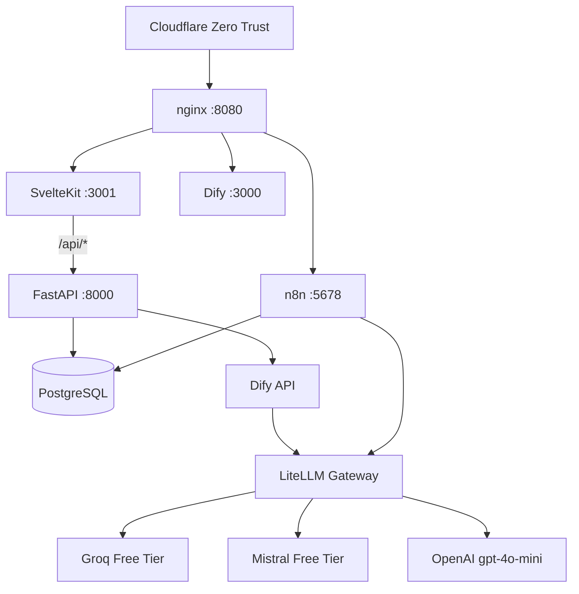
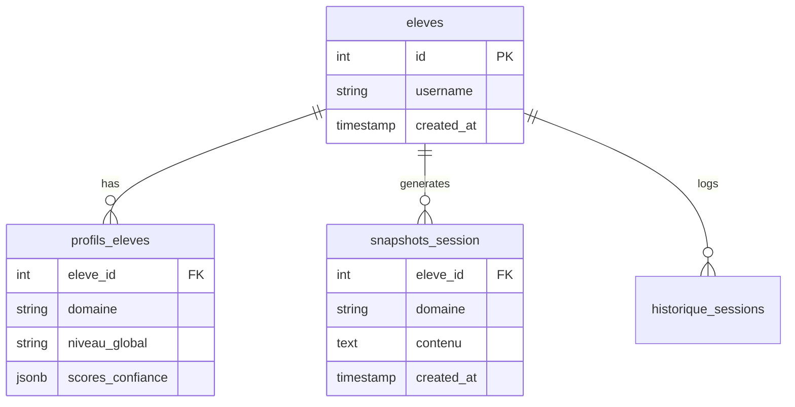

# Session 5 — Documentation Portfolio

> **Duree estimee** : 5-6h (S5a 3-4h + S5b 2h)
> **Statut** : En attente (depend de S1-S3 minimum)
> **Livrable** : README pro EN/FR + docs architecture + decisions + GitHub Profile + demo video
> **Prerequis** : refactor workflow execute (S1-S3), UI webapp dans un etat presentable

---

## Objectif

Transformer les repos GitHub en vitrines portfolio professionnelles : README impactant, architecture documentee, decisions d'ingenierie visibles, le tout bilingue EN/FR avec un effort de maintenance quasi nul.

**Ce que S5 n'est PAS** :
- Pas un site de docs MkDocs/Docusaurus (overkill pour un solo dev avec 6 users)
- Pas de la doc exhaustive de chaque fonction (personne ne la lira)
- Pas de l'auto-generation complexe (git-cliff, tbls, Sphinx — pas justifies a cette echelle)

**Ce que S5 EST** :
- Un README pro qui fait bonne impression en 30 secondes
- Des docs legeres dans `/docs/` rendues nativement par GitHub
- Un GitHub Profile README qui encadre tout
- Une video demo courte qui montre le produit en action

---

## Items audites et tranches

| # | Item | Verdict | Rationale |
|---|------|---------|-----------|
| 1 | README EN pro | KEEP | Le livrable principal. Architecture Mermaid + badges + screenshot + pitch |
| 2 | README FR | KEEP (reduit) | Ecrit une fois, version courte (pas un miroir 1:1). Pas de maintenance sync |
| 3 | Mermaid architecture | KEEP | ROI maximal — 1 diagramme > 500 mots de prose |
| 4 | Mermaid ER (data model) | KEEP | 4 tables = 10 lignes Mermaid a la main. Pas besoin de tbls |
| 5 | Badges shields.io | KEEP (5-6 max) | Custom substance, pas de vanity metrics |
| 6 | Hero screenshot | KEEP | Impact visuel immediat |
| 7 | Decisions table | KEEP (simplifie) | 5-8 decisions cles en tableau, pas de MADR ceremony |
| 8 | Lessons Learned | KEEP | Signal maturite ingenieur — ce qui distingue du projet tuto |
| 9 | Project structure tree | KEEP | Aide comprehension codebase en 10 secondes |
| 10 | GitHub Profile README | KEEP | 30 min, visibilite permanente sur le profil |
| 11 | Demo video | KEEP (S5b) | Apres polish UI, 60-90s screencast |
| 12 | README sinse-workspace | KEEP (S5b, court) | Showcase du workflow multi-IA methodology |
| — | MkDocs Material | CUT | Overkill solo dev. `/docs/` GitHub natif suffit |
| — | FastAPI docs export | CUT | API interne. Screenshot Swagger UI dans docs suffit |
| — | git-cliff | CUT | 20 commits/semaine, changelog manuel suffit |
| — | tbls | CUT | 4 tables, Mermaid a la main |
| — | Uptime Kuma | CUT (hors S5) | Tache infra independante, pas de la doc |
| — | Full code docs Sphinx | CUT | Personne ne lira la doc de chaque fonction |

---

## S5a — Documentation Foundation (3-4h)

### Prerequis

- [ ] Sessions S1, S2, S3 validees
- [ ] Webapp dans un etat presentable (dashboard, chat, stats fonctionnels)
- [ ] Screenshots recents de la webapp pretes
- [ ] 3-4h de concentration dispo

### S5a.1 — Preparation assets (20 min)

- [ ] Creer le dossier assets : `mkdir -p /opt/academia/.github/assets`
- [ ] Capturer 2-3 screenshots de la webapp :
  - Dashboard principal (avec avatar, streaks, XP)
  - Chat Teacher en action (conversation avec format correctif)
  - Page stats/concepts
- [ ] Optimiser les images : `pngquant --quality=65-80 *.png` ou equivalent
- [ ] Verifier que le total assets < 5 Mo

### S5a.2 — README.md principal EN (60 min)

Creer `/opt/academia/README.md` avec cette structure :

```markdown
# Structure du README (pas le contenu verbatim)

1. Logo/titre centre + tagline 1 ligne
2. Ligne de badges (5-6 shields.io custom)
3. Toggle langue : "English | Francais"
4. Hero screenshot (pleine largeur)
5. ## What is Academie-IA? (3-4 lignes pitch)
6. ## Key Features (bullet list 8-10 items)
7. ## Architecture (Mermaid diagram Docker stack)
8. ## Data Model (Mermaid ER diagram 4 tables)
9. ## Tech Stack (tableau avec versions)
10. ## Project Structure (tree des dossiers cles)
11. ## Key Design Decisions (tableau 5-8 decisions)
12. ## Lessons Learned (section reflexive)
13. ## Screenshots (galerie 2-3 captures)
14. ## Getting Started (pre-requis + commandes)
15. ## License
```

#### Badges recommandes :
```markdown


```

#### Mermaid architecture (template) :


#### Mermaid ER (template) :


#### Section "Lessons Learned" (contenu a rediger pendant S5) :
Ce qui impressionne les recruteurs = reflexion honnete sur les trade-offs :
- Pourquoi Dify Chatflow plutot qu'un backend LLM custom
- Ce qu'on ferait differemment (ex: choix de base de donnees, architecture frontend)
- Les surprises techniques (ex: Groq rate limits, Dify plugin daemon instabilite)
- Les compromis cout vs performance (free tier LLMs vs qualite)

### S5a.3 — README.fr.md version francaise (30 min)

Creer `/opt/academia/README.fr.md` :
- **PAS une traduction 1:1** du README.md
- Version plus courte (~50% du EN) couvrant : pitch, features, architecture, tech stack
- Ecrit une fois, pas maintenu en sync avec le EN
- Lien en haut du README.md : `[Francais](README.fr.md)`

### S5a.4 — docs/ folder (45 min)

Creer les fichiers dans `/opt/academia/docs/` (rendus nativement par GitHub) :

#### `docs/architecture.md`
- Version etendue du Mermaid du README
- Diagramme de flux requete utilisateur (browser → Cloudflare → nginx → SvelteKit → FastAPI → Dify → LiteLLM → LLM)
- Diagramme systeme de memoire (2 niveaux : snapshots + profils)
- Explication des choix techniques

#### `docs/decisions.md`
- 5-8 decisions cles extraites de DECISIONS.md
- Format tableau simple (pas MADR) :

```markdown
| # | Decision | Alternatives rejetees | Rationale |
|---|----------|-----------------------|-----------|
| 1 | LiteLLM comme gateway LLM | Appels API directs | Load balancing, fallback, rotation cles gratuit |
| 2 | Dify Chatflow pour Teacher | Backend LLM custom Python | Chatflow visuel, iteration rapide, system prompt complexe |
| 3 | SvelteKit webapp custom | UI native Dify | Controle total UX, gamification, branding |
| 4 | Groq free tier primary | OpenAI payant | 0 EUR pour 90% des sessions, quality suffisante |
| 5 | n8n pour orchestration | Scripts Python cron | UI visuelle, webhooks natifs, maintenance facile |
| 6 | PostgreSQL pour tout | SQLite + fichiers JSON | Relations, JSONB, requetes complexes, backups pg_dump |
| 7 | Cloudflare Zero Trust | VPN classique | Zero config client, WARP gratuit, geoloc France |
| 8 | Self-hosted Proxmox | Cloud (AWS/GCP) | 0 EUR/mois, controle total, apprentissage infra |
```

#### `docs/api-overview.md`
- Liste des endpoints FastAPI avec description
- 1 screenshot de Swagger UI (`/api/docs`)
- Pas de doc exhaustive — juste assez pour montrer que l'API est structuree

### S5a.5 — GitHub Profile README (30 min)

Creer le repo `Sinsemilila/Sinsemilila` (si pas deja fait) avec un README.md :
- Bio 1-2 lignes
- Academie-IA comme projet phare (lien + 1 ligne pitch + screenshot miniature)
- Tech stack icons (badges shields.io ou devicons)
- Eventuellement 1-2 autres projets si existants
- Pas de widgets stats generiques (GitHub stats cards = bruit)
- < 30 lignes visibles

### S5a.6 — Validation S5a (15 min)

- [ ] README.md pousse et rendu correct sur GitHub (verifier Mermaid, images, badges)
- [ ] README.fr.md lie et lisible
- [ ] docs/ folder navigable sur GitHub
- [ ] GitHub Profile README visible sur github.com/Sinsemilila
- [ ] Relecture rapide par Sinse : "est-ce que ca te represente bien ?"

---

## S5b — Polish + Media (2h, optionnel)

> Faire S5b quelques jours/semaines apres S5a, quand l'UI est dans son meilleur etat.

### Prerequis

- [ ] S5a validee
- [ ] UI webapp polish terminee (pas de bugs visuels evidents)
- [ ] Outil de screen recording pret (OBS, Loom, ou simple screen capture)

### S5b.1 — Demo video (45 min)

- [ ] Screencast 60-90 secondes montrant :
  - Login → dashboard (streaks, XP, niveau)
  - Chat Teacher (1-2 echanges avec corrections)
  - Page stats/concepts
  - (Optionnel) onboarding nouveau user
- [ ] Upload sur YouTube (unlisted) ou Loom
- [ ] Ajouter le lien dans README.md section "Demo"
- [ ] Alternative low-effort : GIF de 15-20s du chat en action (si video trop lourde)

### S5b.2 — README sinse-workspace (30 min)

Creer `/root/sinse-workspace/README.md` (si le repo est public) :
- Pitch : "Multi-AI development workflow toolkit"
- Expliquer le concept : comment Claude, Gemini, et Codex collaborent
- Montrer la structure (tools/, slash-commands/, projects/)
- Lister les 15 bash tools avec 1 ligne chacun
- Ce README est secondaire — il showcase la methodologie, pas le produit

### S5b.3 — Review finale + polish (45 min)

- [ ] Relire tous les docs avec un oeil recruteur : est-ce clair pour quelqu'un qui decouvre ?
- [ ] Verifier tous les liens (images, cross-references)
- [ ] Verifier le rendu mobile GitHub (les tableaux passent-ils bien ?)
- [ ] Corriger typos, formulations maladroites
- [ ] Optionnel : ajouter un fichier LICENSE (MIT recommande)
- [ ] Commit final : `git commit -m "[docs] S5b — demo video + polish"`

---

## Criteres de validation Session 5

### S5a (obligatoire)
1. README.md (EN) pousse avec : badges, screenshot, Mermaid archi + ER, tech stack, decisions, lessons learned
2. README.fr.md (FR) lie depuis le README principal
3. docs/architecture.md + docs/decisions.md + docs/api-overview.md crees
4. GitHub Profile README visible sur le profil Sinsemilila
5. Rendu correct sur GitHub (Mermaid, images, liens)

### S5b (optionnel)
6. Demo video/GIF liee dans README
7. sinse-workspace README cree (si repo public)
8. Review finale sans liens casses ni typos

---

## Ce qui a ete volontairement CUT (et pourquoi)

| Item coupe | Raison |
|------------|--------|
| MkDocs Material + GitHub Pages | Overkill solo dev 6 users. `/docs/` GitHub natif suffit. Reconsiderer si le projet passe open-source |
| FastAPI docs export (redocly) | API interne, personne ne peut l'appeler. Screenshot Swagger suffit |
| git-cliff changelog auto | 20 commits/semaine. Changelog manuel ou interne suffit |
| tbls schema auto | 4 tables. Mermaid ER a la main en 10 lignes |
| Uptime Kuma | Tache infra independante, pas de la doc portfolio |
| Full code docs (Sphinx/pdoc) | Personne ne lira la doc de chaque fonction Python |
| ADRs format MADR complet | Ceremonie excessive pour un solo dev. Tableau decisions simple = meme impact |
| Badges vanity (stars, forks) | Signalent rien sur un projet personnel. Badges custom stack = plus informatifs |

Ces items peuvent etre reconsideres si le projet evolue (plus d'users, passage open-source, equipe).

---

## Prochaine session

Pas de session suivante prevue. Apres S5, retour aux features MVP v2 :
- P1 : Admin sinse + XP triggers
- P2 : Flashcards / revision espacee
- P3 : Rapports hebdo n8n
- P4 : Pool LLM BYOK
- P5 : Multi-domaines
